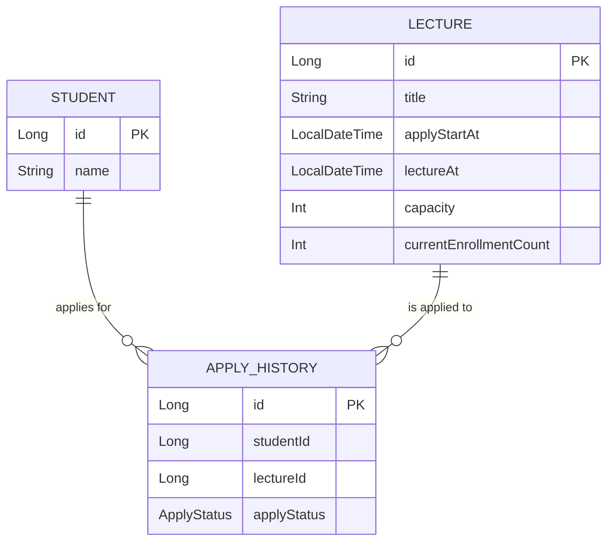

# 항해 플러스

## [TDD]

### WEEK-0001
- TDD 로 Point 시스템을 개발한다. 

### WEEK-0010
- TDD 와 클린 아키텍쳐로 '특강 수강 신청' 시스템을 개발한다.

- ERD

```mermaid
erDiagram
    STUDENT {
        Long id PK
        String name
    }

    LECTURE {
        Long id PK
        String title
        LocalDateTime applyStartAt
        LocalDateTime lectureAt
        Int capacity
        Int currentEnrollmentCount
    }

    APPLY_HISTORY {
        Long id PK
        Long studentId
        Long lectureId
        ApplyStatus applyStatus
    }

    STUDENT ||--o{ APPLY_HISTORY : "applies for"
    LECTURE ||--o{ APPLY_HISTORY : "is applied to"
```
